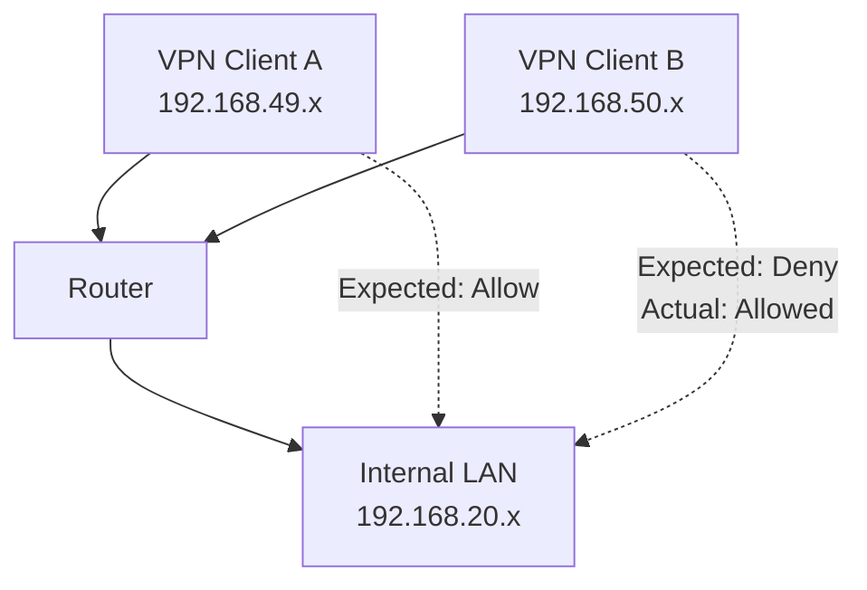
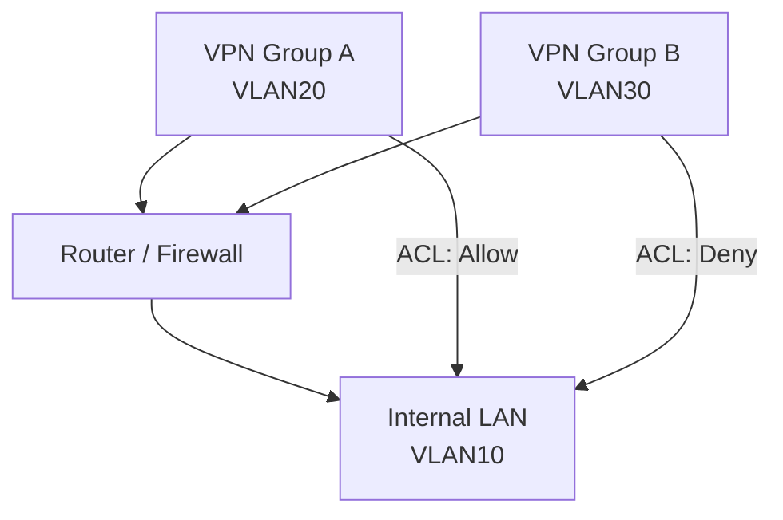

# VPN ACL Limitation and Network Segmentation

## Overview
This repository documents a practical lab validation of VPN client access control using ACLs on a small business router.

The objective was to restrict access to an internal network based on VPN user groups.

---

## Key Finding
ACL rules do not apply to traffic within the same network segment.

---

## Test Scenario

Client Group | Expected | Actual
Group A      | Allow    | Allow
Group B      | Deny     | Allow (unexpected)

---

## Network Design

VPN Client A (192.168.49.x) → Router → LAN (192.168.20.x)  
VPN Client B (192.168.50.x) → Router → LAN (192.168.20.x)

(All clients are treated as part of the same network)

---

## Configuration Summary

VPN IP Pools
Group A → 192.168.49.30 - 192.168.49.45
Group B → 192.168.50.30 - 192.168.50.45

User Assignment
user_a → Group A
user_b → Group B

ACL Rules
Rule 1: Deny
Source: 192.168.50.0/24
Destination: 192.168.20.0/24

Rule 2: Allow
Source: 192.168.49.0/24
Destination: 192.168.20.0/24

---

## Expected Result

user_a → Access allowed
user_b → Access denied

---

## Actual Result

user_a → Access allowed
user_b → Access allowed (unexpected)

---

## Root Cause Analysis

VPN clients are treated as part of the internal LAN.

Traffic classification:
LAN → LAN

---

## Limitation

ACL rules are ineffective for intra-LAN traffic.

---

## Key Insight

Same network → No ACL enforcement
Different networks → ACL applies

---

## Recommended Solution

Option 1: VLAN Segmentation

LAN → VLAN10  
VPN Group A → VLAN20  
VPN Group B → VLAN30  

Result:  
VLAN20 → VLAN10 → Allowed  
VLAN30 → VLAN10 → Denied  

---

Option 2: Separate Subnets / Interfaces

Assign VPN clients to a different interface or subnet than the internal LAN.

---

## Lessons Learned

- ACL does not apply within the same network segment
- VPN clients may be treated as LAN devices
- Network segmentation is essential for access control
- IP-based grouping alone is insufficient

---

## Conclusion

Access control must be designed with network segmentation in mind.

ACL alone is not sufficient without proper network isolation.

---

## Notes

- Behavior may vary depending on implementation
- Always validate in a lab environment before production deployment

---

## Why This Matters

In real-world environments, ACL alone is often insufficient.

Proper network segmentation is required to enforce security policies correctly.
